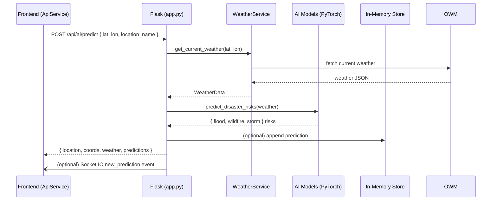
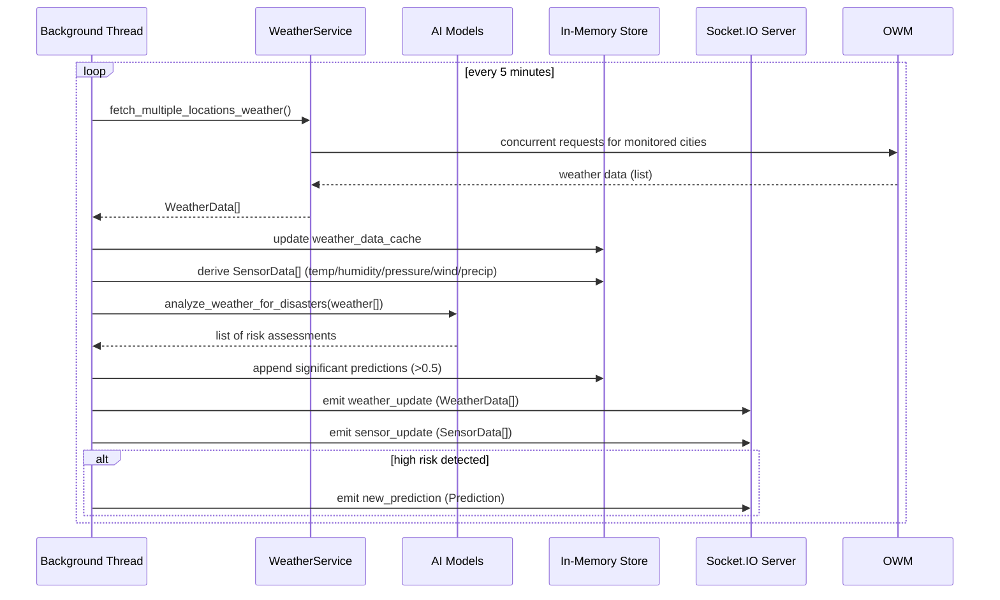

# DisastroScope Architecture

This document illustrates the end-to-end request flow, key components, and the real-time update pipeline used by DisastroScope.

## Component Overview

```mermaid
flowchart LR
  subgraph Frontend [Frontend (React + TypeScript)]
    UI[Pages & Components]\n(Landing, Predictions, Dashboard)
    Hooks[Hooks]\n(useDisasterEvents, usePredictions, useSensorData, useStats)
    API[ApiService]\n(REST + Socket.IO client)
  end

  subgraph Backend [Backend (Flask + Socket.IO + PyTorch)]
    FLASK[Flask App]\n(app.py: REST endpoints)
    SIO[Socket.IO Server]\n(real-time events)
    WEATHER[WeatherService]\n(async OpenWeather + cache)
    AI[AI Models]\n(PyTorch models + scalers)
    STORE[In-Memory Stores]\n(events, predictions, sensors, weather_cache)
    BG[Background Scheduler]\n(thread: fetch -> analyze -> broadcast)
  end

  subgraph External [External Services]
    OWM[OpenWeatherMap API]
    MAPBOX[Mapbox]
  end

  UI <--> Hooks
  Hooks <--> API
  API <--> FLASK
  API <-.-> SIO
  FLASK <--> WEATHER
  FLASK <--> AI
  FLASK <--> STORE
  BG --> WEATHER
  BG --> AI
  BG --> STORE
  BG --> SIO
  UI --> MAPBOX
  WEATHER --> OWM
```

## Sequence: On-demand AI Prediction (POST /api/ai/predict)



## Sequence: Background Scheduler (Real-time updates)



## Socket.IO Events

Server (backend/app.py)
- connect, disconnect
- subscribe_events -> emits events_update
- subscribe_predictions -> emits predictions_update
- subscribe_weather -> emits weather_update
- new_event: emitted when POST /api/events creates an event
- new_prediction: emitted by background scheduler and POST /api/predictions
- sensor_update: emitted by background scheduler
- weather_update: emitted by background scheduler

Client (src/services/api.ts)
- Subscribes to: new_event, new_prediction, sensor_update, weather_update, events_update, predictions_update
- Exposes: subscribeToEvents(), subscribeToPredictions(), subscribeToWeather()

Hooks (src/hooks/useFlaskData.ts)
- useDisasterEvents: subscribes to new_event + events_update
- usePredictions: subscribes to new_prediction + predictions_update
- useSensorData: subscribes to sensor_update
- useStats: periodic /api/stats polling every 30s

## Data Flow Summary
- REST: CRUD for events/predictions/sensors, AI predict, stats, health, and weather endpoints.
- WebSockets: push weather/sensors/predictions for real-time UX.
- Background thread: runs every 5 minutes to fetch weather, update stores, run AI, and broadcast.

## Configuration & Keys
- Backend: set OPENWEATHER_API_KEY (environment variable)
- Frontend: set MAPBOX_ACCESS_TOKEN (e.g., in .env for Vite)

## Notes
- Persistence is currently in-memory; integrate a DB for durability.
- The background scheduler is started in app.py (__main__). Adjust interval in background_task if needed.
- To receive weather pushes on the client, call apiService.subscribeToWeather() in a page or a global effect.
